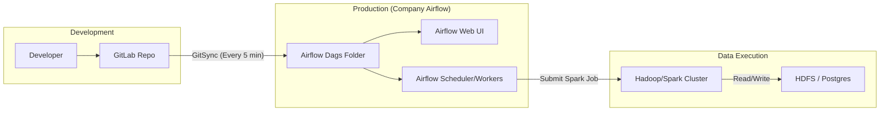

## Deployment & Sync Flow

## System Components

### 1. GitLab Repository (The Source of Truth)
Since you don't have Airflow Admin permissions, the repository is your primary interface. Any changes to SQL files or DAGs are automatically synced to Airflow within 5 minutes.

### 2. Generic API Extraction (`api_to_raw.py`)
Instead of hardcoding every API, use a **Templated Extractor**:
- **Inputs**: `url_template`, `params_template`, `connection_name`.
- **Logic**: 
  1. Resolves `url` using Jinja2 (e.g., `.../apps?date={{logDate}}`).
  2. Loads credentials from `CREDENTIALS_DIR` based on `connection_name`.
  3. Fetches data using `requests` (Python 2.7).
  4. Saves output directly to the **Raw Layer** in HDFS.
- **Benefit**: Adding a new API just means adding one line to your Airflow DAG (or a simple config file).

### 3. Native Airflow DAGs
DAGs will use `BashOperator` or `SparkSubmitOperator` to call your simplified transformation scripts. Since you can only see the Web UI, the DAGs will be designed to show clear task dependencies (e.g., `extract -> etl -> std -> cons`).

### 4. Credential Management
Existing credentials on Hadoop are used automatically. The scripts will leverage the pre-configured environment variables and JDBC drivers available on the Airflow workers.
